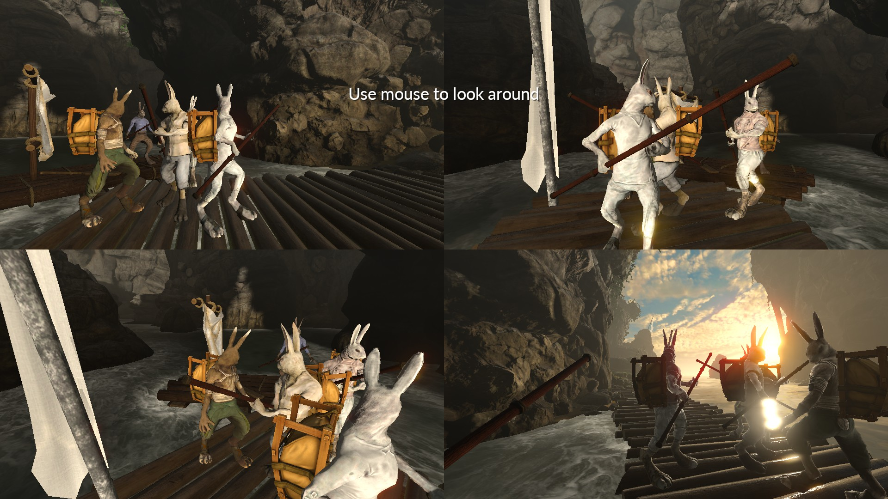

# Full (local-)co-op Overgrowth mod

Play any map or mode in full local co-op! (Or even online using remote play!)
Press F9 to add a player, and F10 to remove a player: that's it.

Upload available on the [Steam Workshop](https://steamcommunity.com/sharedfiles/filedetails/?id=2637639111)

Credit for the thumbnail art to a great-yet-uncredited friend!
Also many thanks to the Wolfire Discord and other mod developers.

## License
[MIT](LICENSE)
